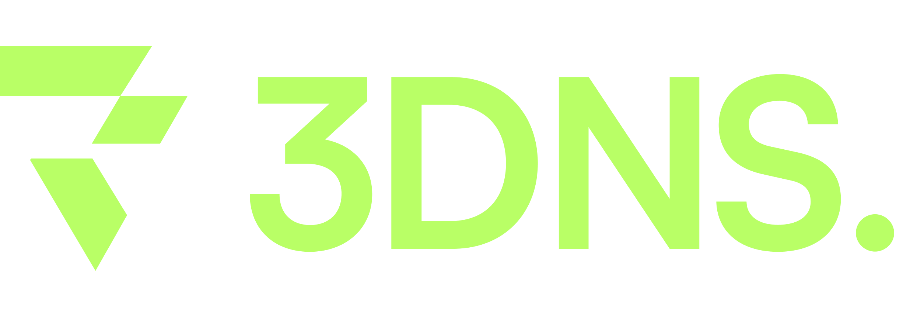
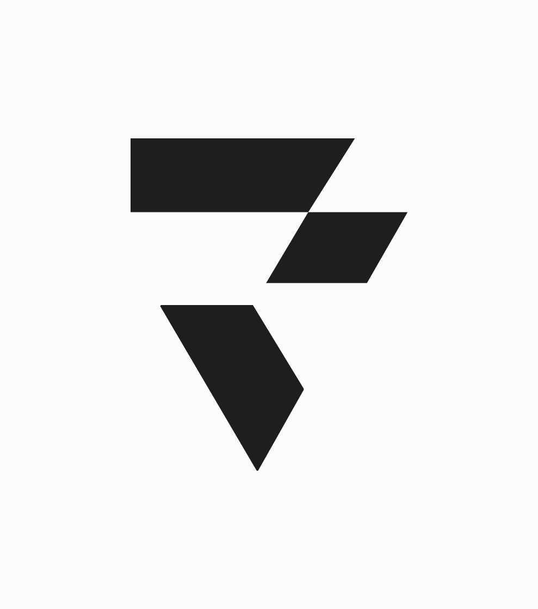
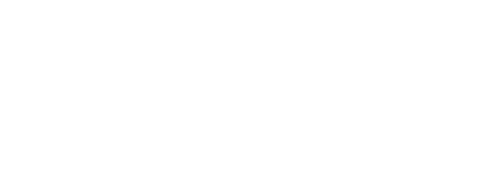
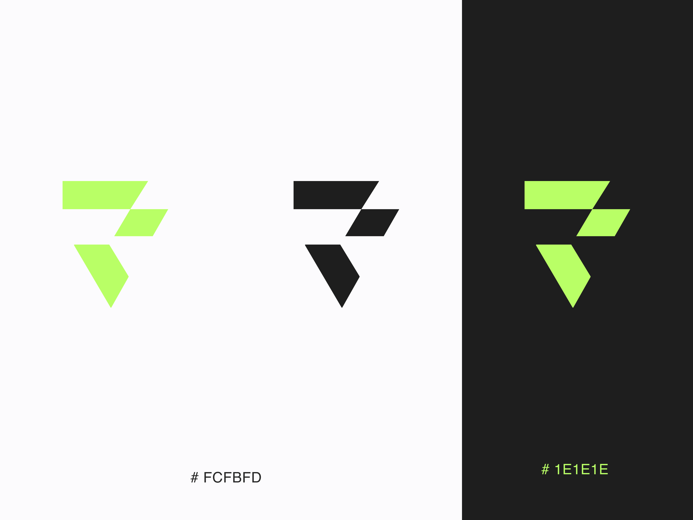
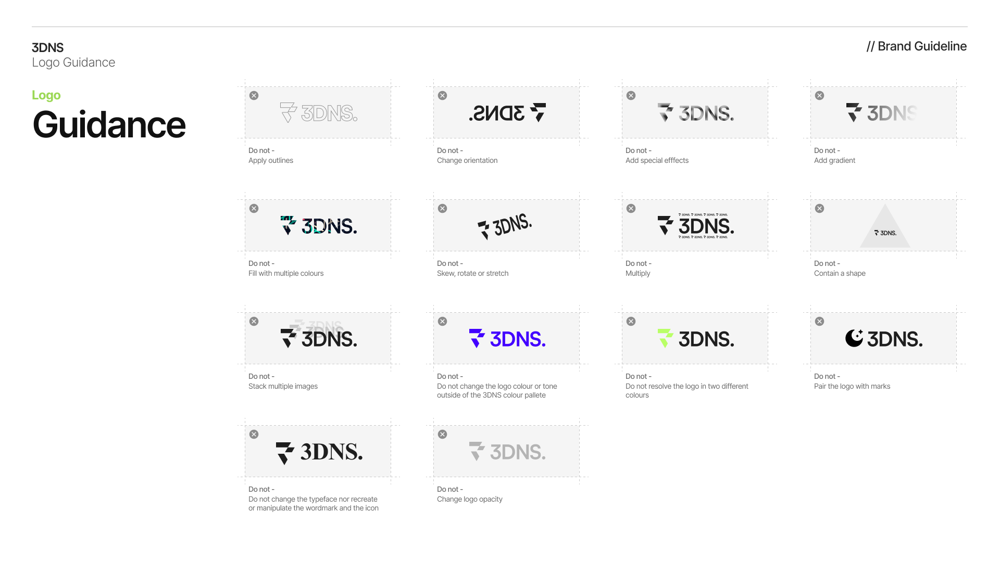

  

Introducing the 3DNS **Brand Kit**, our visual identity guide. Inside you'll find all the brand tools you'll need.

3DNS is the world's first onchain domain registrar. Register more than 430 TLD's from our app like .com, .xyz and .io. Names on 3DNS function as ENS names, in addition to being DNS names, meaning you only need one name to be onchain and online. 

## Logos

<table>
  <tr>
    <td>
      
    </td>
    <td>
      
    </td>
  </tr>
  <tr>
    <td>
      
    </td>
    <td>
      
    </td>
  </tr>
</table>

### Usage

#### Guidance

## Support

For support open an issue, or jump into our Discord to chat with the community.

